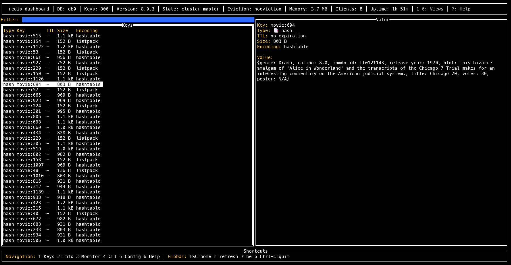

# redis-valkey-tui

[](https://goreportcard.com/report/github.com/mohan-s-gopal/redis-valkey-tui)
[](https://github.com/mohan-s-gopal/redis-valkey-tui/releases)
[](https://opensource.org/licenses/MIT)

A powerful, k9s-inspired Terminal User Interface (TUI) Redis/Valkey client built with Go. Provides an intuitive, keyboard-driven interface for Redis database management with real-time monitoring, advanced key management, and built-in CLI functionality.

<!-- Demo GIF - replace with actual recording -->


## 🌟 Features

### 🎯 Multi-View Navigation
- **Keys View**: Advanced key browsing with filtering, type display, and TTL management
- **Info View**: Comprehensive Redis server information and statistics
- **Monitor View**: Real-time metrics with client connections, command statistics, slow queries, and cluster nodes
- **CLI View**: Integrated Redis CLI with command history and scrollable output
- **Config View**: Runtime configuration management
- **Help View**: Interactive help and keyboard shortcuts

### 🔧 Advanced Key Management
- Smart key filtering and searching
- Multiple data type support (String, Hash, List, Set, ZSet, etc.)
- Batch operations and key expiration management
- Memory usage and TTL information display

### 📊 Real-time Monitoring
- **Client Connections**: Active clients, total connections, rejected connections
- **Memory Usage**: Used memory and RSS with human-readable formatting
- **Command Statistics**: Total commands, operations per second, hit/miss rates
- **Slow Query Log**: Monitor slow-running operations
- **Cluster Nodes**: Detailed node information in table format for cluster setups

### 💻 Integrated CLI
- Full Redis command support with syntax highlighting
- Command history with up/down arrow navigation
- Scrollable output with Page Up/Down support
- Tab to switch focus between input and output areas

### ⚙️ Configuration Management
- **TLS/SSL Support**: Secure connections with certificate authentication
- JSON-based configuration with environment variable support
- Runtime configuration updates
- Connection pooling and timeout management

### 🎨 User Experience

## 🚀 Quick Start

### Installation

#### Option 1: Download Pre-built Binaries (Recommended)
```bash
# Linux (x86_64)
curl -L https://github.com/mohan-s-gopal/redis-valkey-tui/releases/latest/download/redis-valkey-tui_Linux_x86_64.tar.gz | tar xz
sudo mv redis-valkey-tui /usr/local/bin/

# Linux (ARM64)
curl -L https://github.com/mohan-s-gopal/redis-valkey-tui/releases/latest/download/redis-valkey-tui_Linux_arm64.tar.gz | tar xz
sudo mv redis-valkey-tui /usr/local/bin/

# macOS (Intel)
curl -L https://github.com/mohan-s-gopal/redis-valkey-tui/releases/latest/download/redis-valkey-tui_Darwin_x86_64.tar.gz | tar xz
sudo mv redis-valkey-tui /usr/local/bin/

# macOS (Apple Silicon)
curl -L https://github.com/mohan-s-gopal/redis-valkey-tui/releases/latest/download/redis-valkey-tui_Darwin_arm64.tar.gz | tar xz
sudo mv redis-valkey-tui /usr/local/bin/

# Windows (PowerShell)
Invoke-WebRequest -Uri "https://github.com/mohan-s-gopal/redis-valkey-tui/releases/latest/download/redis-valkey-tui_Windows_x86_64.zip" -OutFile "redis-valkey-tui.zip"
Expand-Archive -Path "redis-valkey-tui.zip" -DestinationPath "."
# Add to PATH or move to desired location
```

#### Option 2: Install via Go
```bash
go install github.com/mohan-s-gopal/redis-valkey-tui@latest
```

#### Option 3: Build from Source
```bash
git clone https://github.com/mohan-s-gopal/redis-valkey-tui.git
cd redis-valkey-tui
go build -o redis-valkey-tui ./cmd
```

### Verify Installation

```bash
# Check version
redis-valkey-tui -version

# Test connection to local Redis
redis-valkey-tui

# Should display the TUI interface if Redis is running on localhost:6379
```

### Running

```bash
# Start with default settings (localhost:6379)
./redis-valkey-tui

# Connect to specific Redis instance
./redis-valkey-tui -host redis.example.com -port 6380 -db 1

# Enable debug logging
./redis-valkey-tui -v 2
```

## 📋 Command Line Options

```
Usage: redis-valkey-tui [OPTIONS]

Connection Options:
  -host string        Redis host (default "localhost")
  -port int           Redis port (default 6379)
  -password string    Redis password
  -db int             Redis database number (default 0)

Application Options:
  -config string     Config file path (default "~/.redis-valkey-tui/config.yaml")
  -v int             Verbosity level 0-4 (default 0)
  -version           Show version information

Examples:
  redis-valkey-tui                                    # Connect to localhost:6379
  redis-valkey-tui -host prod.redis.com -port 6380    # Connect to remote Redis
  redis-valkey-tui -db 2 -v 2                         # Use database 2 with debug logging
```

### Configuration

Create `~/.redis-valkey-tui/config.json`:

```json
{
  "redis": {
    "host": "localhost",
    "port": 6379,
    "password": "",
    "db": 0,
    "timeout": 5000,
    "pool_size": 10,
    "tls": {
      "enabled": false,
      "cert_file": "",
      "key_file": "",
      "ca_file": "",
      "insecure_skip_verify": false
    }
  },
  "ui": {
    "theme": "default",
    "refresh_interval": 1000,
    "max_keys": 1000,
    "show_memory": true,
    "show_ttl": true
  }
}
```

### TLS/SSL Configuration

For secure Redis connections, enable TLS in your configuration:

```json
{
  "redis": {
    "host": "secure-redis.example.com",
    "port": 6380,
    "tls": {
      "enabled": true,
      "cert_file": "/path/to/client.crt",
      "key_file": "/path/to/client.key", 
      "ca_file": "/path/to/ca.crt",
      "insecure_skip_verify": false
    }
  }
}
```

**TLS Options:**
- `enabled`: Enable/disable TLS connection
- `cert_file`: Path to client certificate file (optional)
- `key_file`: Path to client private key file (optional)
- `ca_file`: Path to CA certificate file (optional)
- `insecure_skip_verify`: Skip certificate verification (not recommended for production)

## 🎮 Navigation & Controls

### Global Navigation
| Key | Action |
|-----|--------|
| `1` | Switch to Keys view (main screen) |
| `2` | Switch to Info view |
| `3` | Switch to Monitor view |
| `4` | Switch to CLI view |
| `5` | Switch to Config view |
| `6` | Switch to Help view |
| `ESC` | Return to main screen (Keys view) |
| `?` | Show help modal |
| `Ctrl+C` | Quit application |
| `Ctrl+R` | Refresh current view |

### Keys View
| Key | Action |
|-----|--------|
| `↑/↓` | Navigate keys |
| `Enter` | View key details |
| `/` | Focus filter input |
| `r` | Refresh key list |
| `d` | Delete selected key |
| `e` | Edit selected key |
| `t` | Set/modify TTL |
| `Mouse Click` | Select key (mouse interaction enabled) |

**Filter Controls:**
- `Ctrl+L` - Clear filter input
- `Ctrl+C` - Clear filter and return to table
- `ESC` - Return to table without clearing filter
- **Mouse clicks** work properly on filtered results to select keys
- **Arrow key navigation** works correctly after filtering

### CLI View
| Key | Action |
|-----|--------|
| `Enter` | Execute command |
| `↑/↓` | Navigate command history (when input focused) / Scroll output (when output focused) |
| `Tab` | Switch focus between input and output |
| `Ctrl+L` | Clear output screen |
| `PgUp/PgDn` | Scroll output by 10 lines (when output has focus) |
| `Home/End` | Jump to beginning/end of output (when output has focus) |
| `Mouse Scroll` | Scroll output with mouse wheel |

**Focus Management:**
- **Input field** is focused by default for command entry
- **Arrow keys** navigate command history only when input is focused
- Press `Tab` to switch focus to output area for scrolling
- **Arrow keys** scroll output line by line when output is focused
- **Page Up/Down, Home/End** work for navigation when output is focused
- Mouse scrolling works in output area regardless of focus

### Monitor View
| Key | Action |
|-----|--------|
| `s` | Start/stop real-time monitoring |
| `c` | Clear screen |
| `r` | Refresh metrics |
| `↑/↓` | Scroll through metrics (when monitoring stopped) |

**Monitor Features:**
- Real-time client connection tracking
- Command statistics with hit/miss rates
- Slow query log monitoring
- Cluster nodes table with role and status
- Memory usage with human-readable formatting

**Important Notes:**
- Number keys (1-6) work as navigation shortcuts only when not typing in input fields
- Filter inputs correctly handle numbers without triggering view switches
- CLI output scrolling works properly when output area has focus (use Tab to switch focus)
- Mouse interaction is enabled for key selection in Keys view, including filtered results
- Filter input can be cleared quickly with Ctrl+L or Ctrl+C shortcuts
- Arrow key navigation works correctly in filtered key lists


## 🔧 Development

### Prerequisites
- Go 1.19 or later
- Redis/Valkey server for testing
- Terminal with color support

### Building from Source
```bash
git clone https://github.com/mohan-s-gopal/redis-valkey-tui.git
cd redis-valkey-tui
go mod tidy
go build -o redis-valkey-tui ./cmd
```

### Running Tests
```bash
# Run all tests
go test ./...

# Run with coverage
go test -v -cover ./...

# Run specific test
go test -v ./internal/redis
```

### Development Workflow
1. Make changes to source code
2. Run tests to ensure functionality
3. Build and test the application
4. Submit pull request with description
